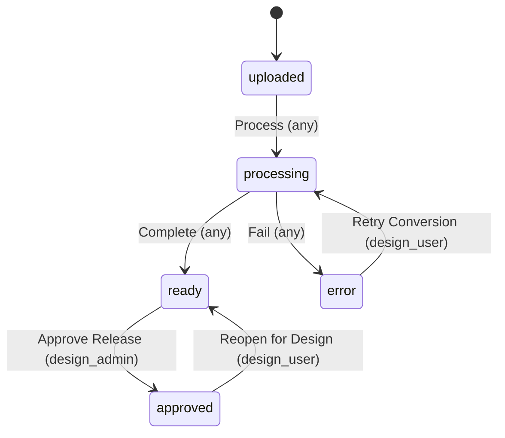
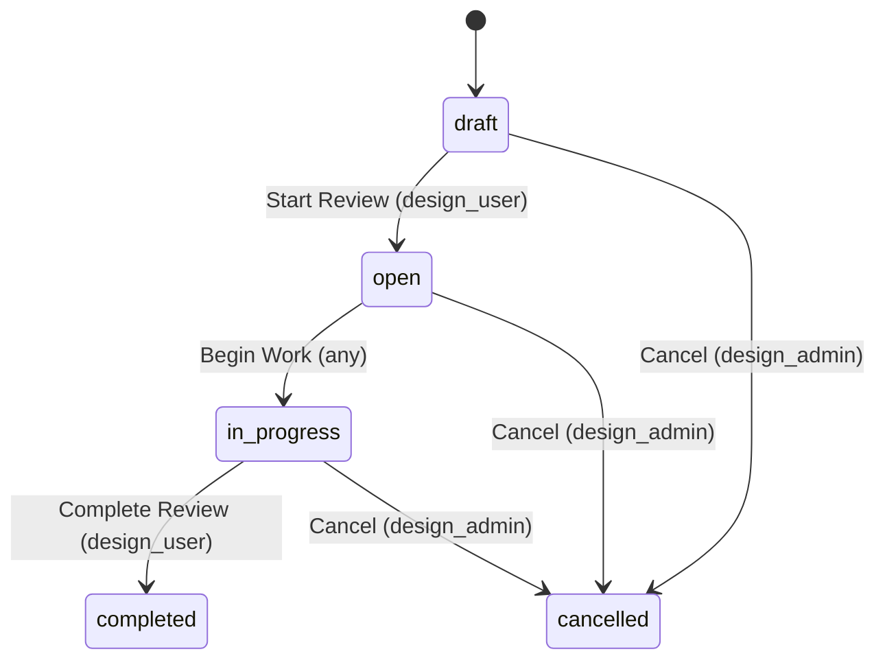
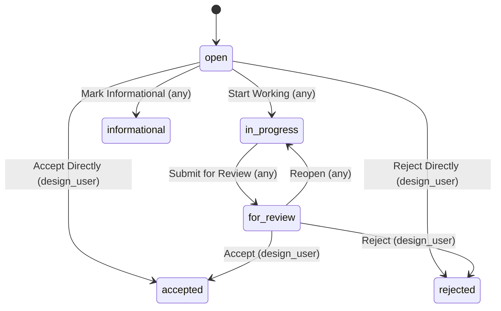
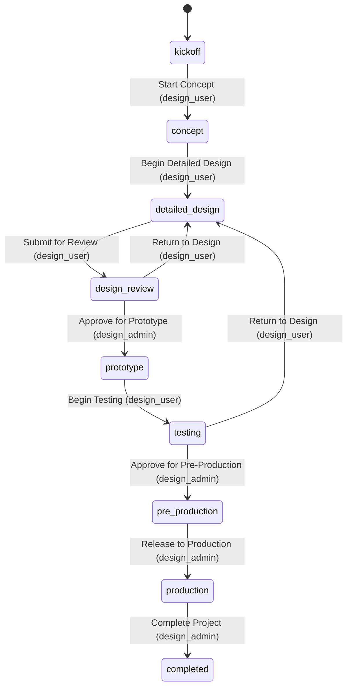
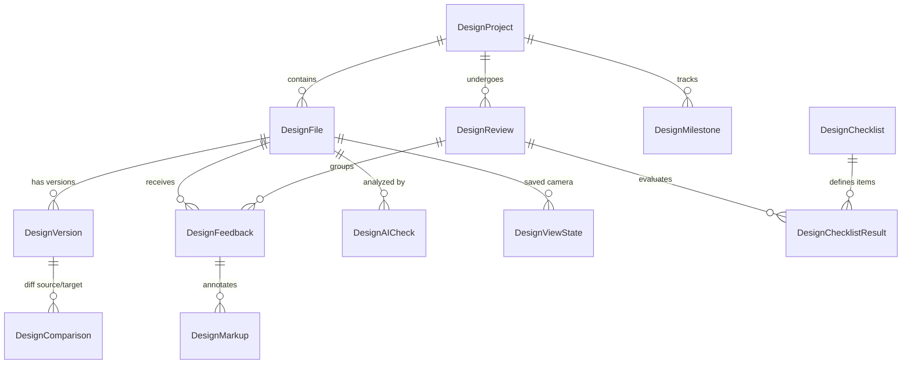

# AgentSwitch Design Review — Entity Schemas & Workflow State Machines

> **Seat**: `designreview` | **Primary Role**: `design_user` | **Allowed Apps**: `["designreview", "agent", "crm"]`  
> **Source**: `/api/schemas`

---

## 1. Executive Summary

The Design Review domain contains **24 entity types**:
- **6 Workflow Entities with State Machines (`flow`)**: Governed by strict state transition rules and role-based permissions (`DesignFile`, `DesignReview`, `DesignFeedback`, `DesignProject`, `DesignSupplierRequest`, `DesignShare`).
- **18 Supporting & Analytical Entities**: Ledger records, AI findings, checklists, BOMs, assemblies, view states, and markup metadata.

---

## 2. Workflow State Machines (`flow`)

### 2.1. `DesignFile`
Governs CAD/drawing file ingestion, conversion pipelines, and release gating.

| From State | To State | Action | Required Role | Notes / Description |
| :--- | :--- | :--- | :--- | :--- |
| `uploaded` | `processing` | **Process** | `any` | Kicks off CAD format conversion / extraction pipeline. |
| `processing` | `ready` | **Complete** | `any` | Geometry extraction succeeded; viewable in 3D viewer. |
| `processing` | `error` | **Fail** | `any` | Conversion pipeline failed (e.g. invalid STEP/BREP). |
| `error` | `processing` | **Retry Conversion** | `design_user` | Re-queues the file for background conversion. |
| `ready` | `approved` | **Approve Release** | `design_admin` | Gates release to production or manufacturing. |
| `approved` | `ready` | **Reopen for Design** | `design_user` | Returns released file to working state for revisions. |

* **States**: `uploaded` *(initial)*, `processing`, `ready`, `approved`, `error`
* **Key Fields**: `name`, `file_format`, `file_size_bytes`, `storage_path`, `current_version_id`, `status`, `part_count`, `has_brep`, `has_pmi`, `is_sheet_metal`, `is_pcb`, `material`, `conversion_error`, `project_id`.

---

### 2.2. `DesignReview`
Coordinates formal engineering design reviews, checklists, and sign-offs.

| From State | To State | Action | Required Role | Notes / Description |
| :--- | :--- | :--- | :--- | :--- |
| `draft` | `open` | **Start Review** | `design_user` | Publishes review to assigned reviewers. |
| `open` | `in_progress` | **Begin Work** | `any` | Reviewers start logging feedback and checking items. |
| `in_progress` | `completed` | **Complete Review** | `design_user` | All blocking feedback resolved; review is finalized. |
| `draft` | `cancelled` | **Cancel** | `design_admin` | Discards review. |
| `open` | `cancelled` | **Cancel** | `design_admin` | Discards review. |
| `in_progress` | `cancelled` | **Cancel** | `design_admin` | Discards review. |

* **States**: `draft` *(initial)*, `open`, `in_progress`, `completed`, `cancelled`
* **Key Fields**: `title`, `project_id`, `description`, `review_type` (`peer`, `stage_gate`, `manufacturing_dfm`, `supplier`, `ai_review`), `due_date`, `priority`, `status`, `checklist_id`, `total_feedback`, `resolved_feedback`, `completion_percent`, `files_under_review`, `reviewers`.

---

### 2.3. `DesignFeedback`
Tracks comments, DFM issues, cost-savings opportunities, and design markups.

| From State | To State | Action | Required Role | Notes / Description |
| :--- | :--- | :--- | :--- | :--- |
| `open` | `in_progress` | **Start Working** | `any` | Assignee begins addressing the feedback. |
| `open` | `informational` | **Mark Informational** | `any` | Clarification only; no design change required. |
| `open` | `accepted` | **Accept Directly** | `design_user` | Instant sign-off without full review cycle. |
| `open` | `rejected` | **Reject Directly** | `design_user` | Rejected without work (out of scope/invalid). |
| `in_progress` | `for_review` | **Submit for Review** | `any` | Fix committed; ready for lead reviewer verification. |
| `for_review` | `accepted` | **Accept** | `design_user` | Solution verified and approved. |
| `for_review` | `rejected` | **Reject** | `design_user` | Proposed fix unacceptable; needs rework. |
| `for_review` | `in_progress` | **Reopen** | `any` | Re-opens item for additional adjustments. |

* **States**: `open` *(initial)*, `in_progress`, `for_review`, `accepted`, `rejected`, `informational`
* **Key Fields**: `title`, `description`, `resolution`, `feedback_type` (`issue`, `suggestion`, `question`, `approval`, `ai_finding`), `priority`, `status`, `review_id`, `file_id`, `version_id`, `assembly_id`, `assigned_to`, `author_id`, `tags`, `part_id`, `pin_position_json`, `view_state_json`, `ai_generated`, `ai_confidence`, `standard_reference`, `unit_savings`, `total_annual_savings`.

---

### 2.4. `DesignProject`
Manages product lifecycle stage-gates from Kickoff to Production.

| From State | To State | Action | Required Role | Notes / Description |
| :--- | :--- | :--- | :--- | :--- |
| `kickoff` | `concept` | **Start Concept** | `design_user` | Moves project into initial concept exploration. |
| `concept` | `detailed_design` | **Begin Detailed Design** | `design_user` | Moves to 3D CAD modeling & assembly creation. |
| `detailed_design` | `design_review` | **Submit for Review** | `design_user` | Freezes design for formal gate review. |
| `design_review` | `detailed_design` | **Return to Design** | `design_user` | Sent back if review findings require redesign. |
| `design_review` | `prototype` | **Approve for Prototype** | `design_admin` | Gates initial physical prototyping. |
| `prototype` | `testing` | **Begin Testing** | `design_user` | Initiates DVP&R / physical lab tests. |
| `testing` | `detailed_design` | **Return to Design** | `design_user` | Sent back if tests reveal failure modes. |
| `testing` | `pre_production` | **Approve for Pre-Production** | `design_admin` | Gates tooling & pilot runs. |
| `pre_production` | `production` | **Release to Production** | `design_admin` | Final sign-off for serial production. |
| `production` | `completed` | **Complete Project** | `design_admin` | Marks project finished. |
| *Any Active* | `on_hold` | **Put On Hold** | `design_admin` | Freezes project activities temporarily. |
| `on_hold` | *Prior State* | **Resume** | `design_admin` | Restores to kickoff, concept, or detailed design. |
| *Any Active* | `cancelled` | **Cancel** | `design_admin` | Terminates project. |

* **States**: `kickoff` *(initial)*, `concept`, `detailed_design`, `design_review`, `prototype`, `testing`, `pre_production`, `production`, `completed`, `on_hold`, `cancelled`
* **Key Fields**: `name`, `code`, `description`, `status`, `lead_designer_id`, `target_completion_date`, `budget`, `currency`, `cad_system`, `lead_company_id`, `customer_id`.

---

### 2.5. `DesignSupplierRequest`
External RFQ, DFM request, or manufacturing review sent to suppliers.

* **States**: `pending` *(initial)* $\rightarrow$ `responded` | `expired` | `cancelled`
* **Transitions**:
  * `[pending] --(Record Supplier Response [system])--> [responded]`
  * `[pending] --(Expire Request [system])--> [expired]`
  * `[pending] --(Cancel Request [design_admin])--> [cancelled]`
* **Key Fields**: `request_number`, `supplier_id`, `project_id`, `file_id`, `version_id`, `request_type` (`dfm_feedback`, `quote`, `tooling_feasibility`, `first_article_inspection`), `status`, `due_date`, `response_notes`, `response_received_at`.

---

### 2.6. `DesignShare`
Secure public or password-protected external links for viewing CAD models.

* **States**: `active` *(initial)* $\rightarrow$ `expired` | `revoked`
* **Transitions**:
  * `[active] --(Expire [any])--> [expired]`
  * `[active] --(Revoke [design_user])--> [revoked]`
* **Key Fields**: `share_token`, `share_type`, `recipient_email`, `recipient_name`, `expires_at`, `max_views`, `view_count`, `allow_download`, `allow_feedback`, `watermark_text`, `status`.

---

## 3. Supporting & Analytical Entities (Complete Reference)

| Entity Name | Kind | Description & Key Fields |
| :--- | :--- | :--- |
| **`DesignVersion`** | `ledger` | Version history of a CAD file. Fields: `file_id`, `version_number`, `commit_message`, `file_hash`, `parent_version_id`, `diff_from_parent_json`, `metadata_json`, `assembly_tree_json`, `gltf_file`, `step_file`, `brep_cache`, `conversion_status`. |
| **`DesignComparison`** | `record` | Output of comparing two file revisions. Fields: `source_file_id`, `source_version_id`, `target_file_id`, `target_version_id`, `comparison_type`, `diff_result_json`, `added_count`, `removed_count`, `modified_count`, `diff_gltf_file`. |
| **`DesignAICheck`** | `record` | AI-driven checks and DFM evaluations. Fields: `file_id`, `version_id`, `check_type` (`dfm_analysis`, `gdt_check`, `clearance_check`, `standard_compliance`, `lessons_learned`), `status`, `summary`, `confidence`, `findings_json`, `standards_checked`. |
| **`DesignChecklist`** | `record` | Checklist templates for DFM / manufacturing gates. Fields: `name`, `category`, `is_ai_enabled`, `industry`, `items` (array of checklist items). |
| **`DesignChecklistResult`**| `record` | Audit / verification result for an item in a checklist. Fields: `checklist_id`, `review_id`, `file_id`, `item_id`, `status` (`pass`, `fail`, `waived`, `not_applicable`), `notes`, `verified_by`. |
| **`DesignStandard`** | `record` | Engineering standard repository. Fields: `name`, `category` (`dfm`, `tolerancing`, `fasteners`, `welding`, `materials`), `standard_body` (ISO, ASME, DIN), `standard_number`, `ai_embedding_json`, `is_active`. |
| **`DesignAssembly`** | `record` | Multi-part CAD assembly definition. Fields: `name`, `project_id`, `root_file_id`, `part_count`, `status`. |
| **`DesignAssemblyVersion`**| `ledger` | Snapshot of assembly hierarchy per release. Fields: `assembly_id`, `version_number`, `component_snapshot_json`, `diff_json`, `commit_message`. |
| **`DesignBOM`** | `record` | Bill of materials hierarchy. Fields: `assembly_id`, `part_number`, `quantity`, `material`, `supplier_id`, `unit_cost`. |
| **`DesignMarkup`** | `child` | 3D pin annotations and spatial drawings attached to feedback. Fields: `feedback_id`, `markup_type` (`pin`, `circle`, `arrow`, `freehand`, `measure`), `geometry_json`, `style_json`, `surface_id`, `face_index`. |
| **`DesignViewState`** | `record` | 3D viewport state. Fields: `file_id`, `camera_position_json`, `camera_target_json`, `section_planes_json`, `hidden_parts_json`, `explode_factor`, `analysis_active`. |
| **`DesignSavedView`** | `record` | Named bookmark of a 3D perspective. Fields: `name`, `view_state_id`, `thumbnail`. |
| **`DesignSimulation`** | `record` | CAE/FEA/CFD simulation dataset. Fields: `file_id`, `version_id`, `simulation_type` (`fea_stress`, `thermal`, `flow`, `modal`), `solver`, `vtu_file`, `min_value`, `max_value`, `unit`. |
| **`DesignMilestone`** | `record` | Stage gate milestone with checklist and deliverables. Fields: `project_id`, `milestone_type`, `due_date`, `gate_criteria`, `gate_result`, `is_critical_path`. |
| **`DesignPackage`** | `record` | Bundle of files/drawings for external transmission. Fields: `project_id`, `files` (array of file references), `file_count`. |
| **`DesignRender`** | `record` | High-resolution photorealistic rendering. Fields: `file_id`, `render_engine`, `image_file`, `resolution`. |
| **`DesignReviewNotebook`** | `record` | Rich-text engineering notebook/logbook for review findings. Fields: `review_id`, `content_json`, `author_id`. |
| **`DesignReviewPreferences`**| `record` | User/team defaults for 3D viewer, units, and notification thresholds. |

---

## 4. Entity Relationships Diagram

---

## 5. Agent Implementation Rules & Action Invocations

1. **Invoke Transitions via Action Names**:
   Do not directly `PATCH / PUT` the `status` field on workflow entities. Instead, invoke the specific transition action:
   * **MCP**: `DesignReview.start_review`, `DesignFeedback.accept`, `DesignFile.process`
   * **REST**: `POST /api/entities/{Entity}/{id}/transition` with `{"action": "<Action Name>"}`
2. **Permission Guard**:
   * Our seat is `role: "design_user"`.
   * We can execute all standard review tasks (`Start Review`, `Complete Review`, `Accept/Reject Feedback`, `Retry Conversion`, `Submit for Review`).
   * We **cannot** execute actions marked `role: "design_admin"` (e.g. `Approve Release`, `Cancel Project`, `Approve for Prototype`). Those must be escalated.
3. **Handling Missing Geometry / 501 Stubs**:
   * Endpoints like `analysis/thickness` and `analysis/interference` return `501 Not Implemented` (no CAD kernel in current build).
   * For manufacturability and diff answers, inspect `DesignVersion.commit_message`, `DesignComparison.diff_result_json`, `DesignAICheck`, and call `endpoint.designreview.release_readiness`.
