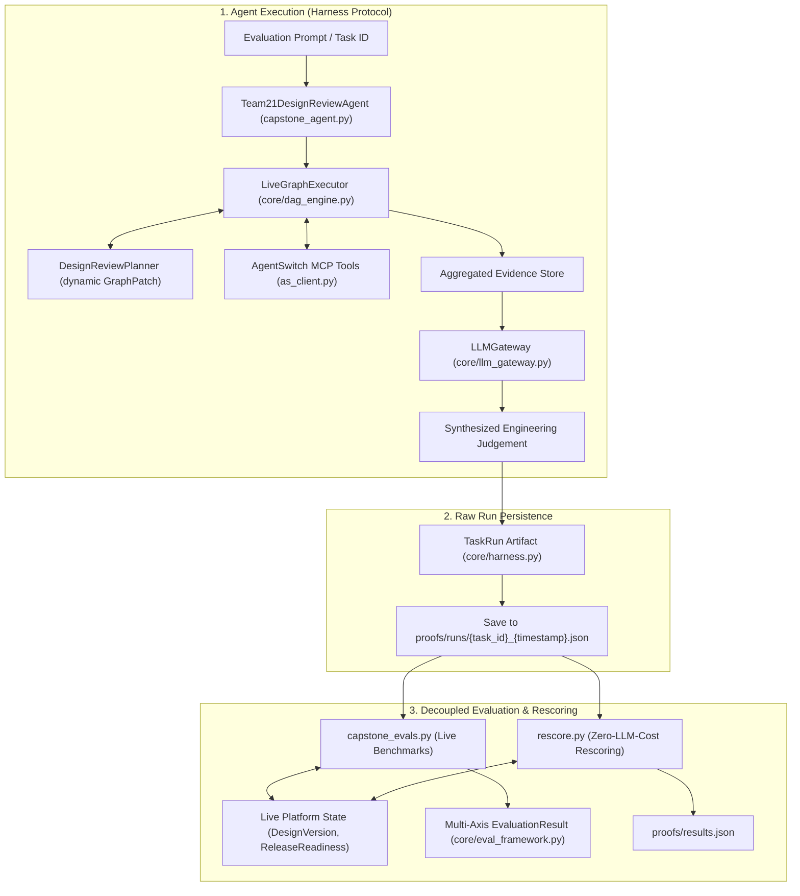

# AgentSwitch — Design Review Seat (`designreview`)

> **EAGv3 Capstone Project** | **Team 21**  
> **Assigned Seat:** Design Review (`designreview`) — Design Files, Versions, Reviews  
> **Core Request:** *"What changed between rev B and rev C, and are there manufacturability problems in this part?"*

---

## 📌 Project Overview

**AgentSwitch** is a multi-agent, enterprise-grade business operations platform spanning 424 entity types deployed across two simulated manufacturing enterprises:
1. **Suryodaya Precision Works** (India — GST / Ind AS)
2. **Keystone Precision Works LLC** (US — Sales & Use Tax / ASC)

Each team operates within an assigned **seat** with specific entity permissions, API scopes, and MCP interfaces. Our seat, **Team 21 (`designreview`)**, is tasked with building an autonomous, MCP-driven agent that can perform multi-step geometric/BOM revision comparisons, inspect design revisions, validate engineering checklists, and assess manufacturability (DFM/DFA) issues.

---

## 🎯 The Core Agent Goal

Our agent must handle the following high-bar engineering evaluation autonomously over Model Context Protocol (MCP) and REST APIs:

```text
"What changed between rev B and rev C, and are there manufacturability problems in this part?"
```

This involves:
- **CAD & BOM Revision Diffing**: Identifying structural, dimensional, and assembly changes between revisions (e.g., rev B vs. rev C).
- **Manufacturability & DFM Analysis**: Surfacing tooling constraints, draft angles, wall thickness deviations, hole-to-edge tolerances, and material callouts.
- **Checklist & Review Validation**: Cross-referencing findings against design validation checklists and supplier capability requests.

---

## 🏗️ Repository Structure & Key Documents

| File / Document | Purpose |
| :--- | :--- |
| **[`PLAN.md`](PLAN.md)** | Master architectural plan, competitive analysis strategy, and roadmap for deliverable execution. |
| **[`GAP_REPORT.md`](GAP_REPORT.md)** | Gap analysis comparing AgentSwitch's `designreview` capabilities with modern industry benchmark tools (e.g., CoLab Software / AutoReview). |
| **[`ENTITY_SCHEMAS.md`](ENTITY_SCHEMAS.md)** | Complete documentation of all 24 `designreview` entity types, including state machines (`DesignFile`, `DesignReview`, `DesignFeedback`, etc.). |
| **[`agentswitch.md`](agentswitch.md)** | Full specification and domain guide for the AgentSwitch platform. |
| **[`agentswitch_tools.json`](agentswitch_tools.json)** | Catalog of MCP tools exposed to our seat for agent orchestration. |
| **[`api_schemas.json`](api_schemas.json)** | Complete OpenAPI schemas for the platform endpoints. |
| **[`as_client.py`](as_client.py)** | Python client for authenticating, querying, and interacting with the AgentSwitch APIs across both tenant instances. |
| **[`capstone_agent.py`](capstone_agent.py)** | Team 21 Capstone Agent conforming to the `Harness` protocol, orchestrating live MCP tools via `LiveGraphExecutor` and synthesis via `LLMGateway`. |
| **[`capstone_evals.py`](capstone_evals.py)** | Ground-truth-separated benchmark evaluation suite testing factual revision delta and release readiness. |
| **[`rescore.py`](rescore.py)** | Offline rescoring utility that scores saved `TaskRun` proof artifacts without re-running paid agent LLM calls. |
| **[`core/harness.py`](core/harness.py)** | Uniform run protocol (`Harness`), step recording (`Step`), and raw proof serialization (`TaskRun`). |
| **[`core/dag_engine.py`](core/dag_engine.py)** | Event-sourced dynamic DAG executor (`LiveGraphExecutor`, `Planner`, `GraphPatch`) with checkpointing. |
| **[`core/llm_gateway.py`](core/llm_gateway.py)** | Tiered, rate-aware multi-provider LLM gateway with automatic fallback, jittered backoff, and cost tracking. |
| **[`core/eval_framework.py`](core/eval_framework.py)** | Multi-axis evaluation harness (`evaluate_run`, `EvaluationResult`) decoupling verifiers from agent output. |
| **[`core/judge.py`](core/judge.py)** | Qualitative LLM-as-a-judge rubric evaluator for engineering depth and specificity. |
| **[`core/economics.py`](core/economics.py)** | Real-time token usage and cost accounting ledger (`CostLedger`). |

---

## ⚙️ Workflow State Machines

The `designreview` seat manages 6 primary flow entities with strict state machines:

1. **`DesignFile`**: `uploaded` ➔ `processing` ➔ `ready` ➔ `approved` *(or `error`)*
2. **`DesignReview`**: `draft` ➔ `in_review` ➔ `approved` *(or `rejected` / `reopened`)*
3. **`DesignFeedback`**: `open` ➔ `in_progress` ➔ `resolved` *(or `dismissed` / `reopened`)*
4. **`DesignProject`**: `planning` ➔ `active` ➔ `on_hold` ➔ `completed` *(or `archived`)*
5. **`DesignSupplierRequest`**: `draft` ➔ `sent` ➔ `received` ➔ `accepted` *(or `rejected`)*
6. **`DesignShare`**: `active` ➔ `revoked` / `expired`

*(See [`ENTITY_SCHEMAS.md`](ENTITY_SCHEMAS.md) for full state transition diagrams and permission matrix)*

---

## 🧪 Agent Harness & Evaluation Architecture

The repository implements a modular, enterprise-grade autonomous agent harness built on principles of **uniform run recording**, **dynamic DAG orchestration**, and **ground-truth-separated evaluation**.



### 1. The Uniform Harness Protocol (`core/harness.py`)
- **Protocol Interface**: Every agent conforms to the `Harness` protocol (`run(task_id: str, prompt: str) -> TaskRun`), ensuring standardized integration across different agent strategies.
- **Structured Run Records (`TaskRun` & `Step`)**: Captures execution telemetry including individual tool invocations, LLM synthesis calls, step latencies, claimed answers, and terminal states (`done`, `error`, `no_ready_nodes`).
- **Pre-Scoring Persistence**: Calls `run.save(proofs_dir)` **before** any evaluation logic touches the result.

### 2. The Raw-Run-Then-Score Split (`rescore.py`)
- **Zero-Cost Iteration**: Evaluation logic and scoring rubrics frequently evolve. By saving raw immutable run proofs to `proofs/runs/`, scoring bugs or new rubric axes can be verified by running `python rescore.py` without re-running expensive LLM agent trajectories.
- **Deterministic by Default**: Standard rescoring executes only deterministic ground-truth verification axes. The optional qualitative LLM-judge axis is triggered explicitly via `--with-judge`.

### 3. Ground-Truth-Separated Evaluation (`capstone_evals.py`, `core/eval_framework.py`)
Rather than relying on naive text matching or trusting the agent's self-generated prose, verifier axes independently re-query live platform state via the MCP client to validate factual correctness:
- **`cites_real_bend_radius_change`**: Validates whether the agent accurately extracts the 2.0 mm ➔ 3.0 mm flange bend radius update from actual version commit logs.
- **`cites_real_blank_growth`**: Confirms the 4.2 mm blank size expansion from physical tooling adjustments.
- **`matches_real_release_readiness`**: Validates that the agent's release recommendation matches live `endpoint.designreview.release_readiness` blockers (`ready: false`).
- **`did_not_fabricate_geometry_diff`**: Refusal-adjacent guard ensuring the agent truthfully acknowledges unpopulated geometric diff JSON rather than hallucinating CAD diff data.
- **`judged_reasoning_quality`**: Evaluates qualitative engineering depth and domain specificity using `core/judge.py`.

### 4. Dynamic Live Graph & LLM Gateway (`core/dag_engine.py`, `core/llm_gateway.py`)
- **`LiveGraphExecutor`**: Manages event-driven task execution with dependency resolution, node checkpointing, and dynamic DAG patching via `DesignReviewPlanner`.
- **`LLMGateway`**: Tier-based model routing (`quality`, `standard`, `fast`) with fallback chains (e.g. Gemini 2.5 Pro ➔ Claude 3.5 Sonnet ➔ GPT-4o), exponential jitter backoff, and ledger tracking (`core/economics.py`).

---

## 🚀 Getting Started

### 1. Prerequisites
- Python 3.10+
- `gh` (GitHub CLI) & `git`
- Virtual environment tool (`venv` or `uv`)

### 2. Environment Setup
Create a `.env` file in the root directory:
```env
SURYODAYA_URL=https://agentswitch.theschoolofai.in
SURYODAYA_EMAIL=team21@theschoolofai.in
SURYODAYA_PASSWORD=your_password_here

KEYSTONE_URL=https://class.agentswitch.theschoolofai.in
KEYSTONE_EMAIL=team21@theschoolofai.in
KEYSTONE_PASSWORD=your_password_here

# LLM Gateway Keys (configure available providers)
GEMINI_API_KEY=your_gemini_key
ANTHROPIC_API_KEY=your_anthropic_key
OPENAI_API_KEY=your_openai_key
```

### 3. Running the Agent & Evaluation Suite

#### A. Quick MCP Client Test
```bash
python as_client.py
```

#### B. Run the Capstone Agent
Executes the live DAG workflow, queries the Design Review MCP tools, synthesizes the DFM analysis, and saves the proof artifact to `proofs/runs/`:
```bash
python capstone_agent.py
```

#### C. Run the Benchmark Evaluation Suite
Executes the agent and scores the resulting run against live ground-truth axes:
```bash
python capstone_evals.py
```

#### D. Rescore Saved Proofs (Offline / Free)
Re-evaluates previously saved run artifacts against ground-truth rubrics without calling the paid agent:
```bash
# Deterministic ground-truth axes only (free, no LLM calls)
python rescore.py

# Include qualitative LLM reasoning judge
python rescore.py --with-judge
```
